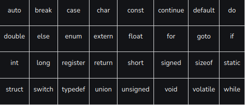

# Solutions: Episode 03 - Variable Rules and Keywords in C



## Part 1: Valid or Invalid?

1. `count` – Valid  
2. `2ndPlace` – Invalid (cannot start with a digit)  
3. `_total` – Valid  
4. `int` – Invalid (reserved keyword)  
5. `user-name` – Invalid (hyphen is not allowed)  
6. `MAXVALUE` – Valid  
7. `my variable` – Invalid (spaces not allowed)  
8. `float` – Invalid (reserved keyword)  
9. `__main__` – Valid (double underscores are legal, but typically reserved for system use)  
10. `$price` – Invalid (dollar sign is not allowed in C identifiers)

---

## Part 2: Fix the Errors

```c
int days3 = 3;
float value = 4.5;
char user_name[] = "John";
int return_value = 1;
int my_variable = 5;
```

---

### Part 3: Keyword Identification

Reserved keywords:
```
switch
register
struct
typedef
```

Not keywords:
```
malloc (function)
define (preprocessor directive)
class (not used in C, it's from C++)
include (preprocessor directive, not a keyword) 
``` 
### Part 4: Keyword Collision
Dude do hardwork don't depends upon only solutions 😁

```c
#include <stdio.h>

int float = 10;

int main() {
  printf("%d\n", float);
  return 0;
}
```