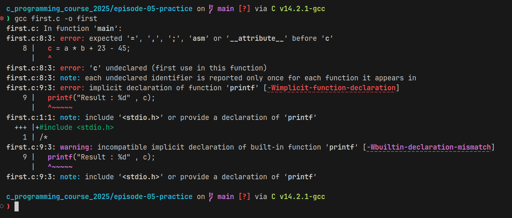
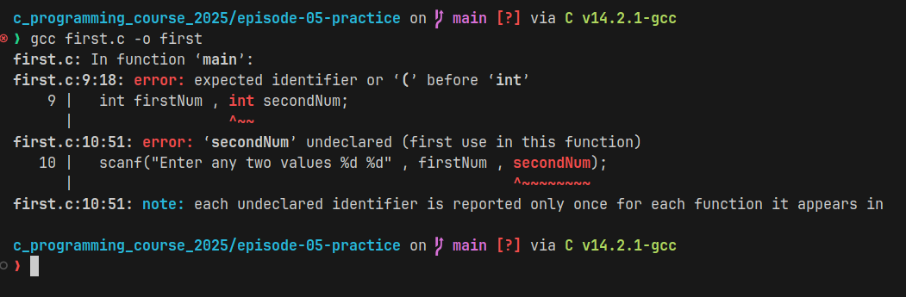

# Solutions of Epi-05

## Answer 1

####  Snippet 1
```c
int main() {
  int a , b; int c
  c = a * b + 23 - 45;
  printf("Result : %d" , c);
}
```
In above program we forget to include `header file`. Without header file we can not access the printf function in `c`.

Also we forget to add `semicolon` in 2nd line after `variable c`.

error : 



---

#### Snippet 2

```c
# include <stdio.h>

int main() {
  int firstNum , int secondNum;
  scanf("Enter any two values %d %d" , firstNum , secondNum);

  printf("firstNum - secondNum = %d" , firstNum - secondNum);\

}
```
When we want deffine or declare to two or more variable in one line then we write only one time `data type` of a variable.

But in line 4th we again use int after `comma` which is wrong.

Whenever we take any input from user in `c` then must provide the `& operator` for refering the address in `c`. 

But in line number 5 we don't use the `& operator` which produce the error.

use of unneccery  `\` after print the diff of two numbers.

error:



---

## Answer 2

1.
```c
#include <stdio.h>

int main() {
  float fahrenheit, celsius;
  printf("Enter temperature in Fahrenheit: ");
  scanf("%f", &fahrenheit);

  celsius = (5.0 / 9.0) * (fahrenheit - 32);
  printf("Temperature in Celsius: %.2f\n\n", celsius);

  return 0;

}

```

2. 
```c
#include <stdio.h>
#include <math.h>

int main() {

    // ------------------ Circle Area & Perimeter ------------------
    float radius;
    const float pi = 3.14;
    printf("Enter radius of circle: ");
    scanf("%f", &radius);

    float circlePerimeter = 2 * pi * radius;
    float circleArea = pi * radius * radius;

    printf("Perimeter of circle: %.2f\n", circlePerimeter);
    printf("Area of circle: %.2f\n\n", circleArea);

    // ------------------ Triangle Area & Perimeter ------------------
    float a, b, c;
    printf("Enter the three sides of triangle: ");
    scanf("%f %f %f", &a, &b, &c);

    float trianglePerimeter = a + b + c;
    float s = trianglePerimeter / 2;

    double triangleArea = sqrt(s * (s - a) * (s - b) * (s - c));

    printf("Perimeter of triangle: %.2f\n", trianglePerimeter);
    printf("Area of triangle: %.2f\n", triangleArea);

    return 0;
}


```
